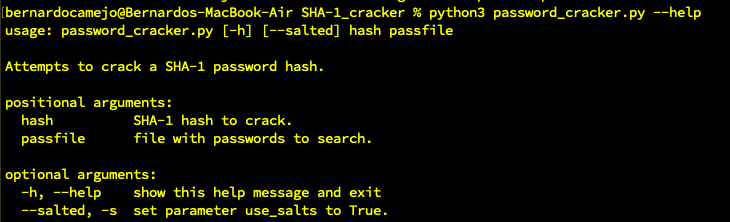
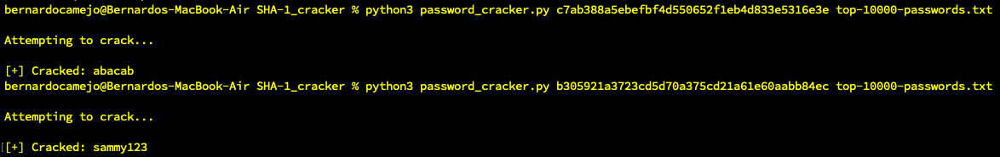

## SHA-1 Cracker

This is a SHA-1 password hash cracker to obtain the clear text of a password hashed with the SHA-1 algorithm function.

The function accepts a hash (found during data exfil possibly) and returns the clear text if it's one of the to 10,000 passwords used. The `passfile` flag can be used to tell the script which of your favourite wordlists to load (if you have `SecLists` or `rockyou.txt`). The files with the script only include the `top-10000-passwords.txt` wordlist. 

If the hash can't be cracked, the script will let you know.

An optional second argument `use_salts` can be set to `True`, and each salt string from another the `known-salts.txt` file will be appended and prepended to each password hashed at the beginning of the function before hashing.

### Command line help menu

### Command line demo

