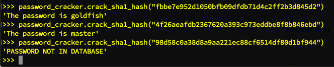

## SHA-1 Cracker

This is a password cracker to figure out passwords that were hashed using SHA-1.

The function accepts a hash (found during data exfil possibly) and returns the clear text if it's one of the to 10,000 passwords used (the list at the moment only includes `top-10000-passwords.txt` but could be expanded to include larger wordlists like `SecLists` or `rockyou.txt`). 

If the hash can't be cracked, the function returns `PASSWORD NOT IN DATABASE`.

Functionality to add: an optional second argument `use_salts` and if set to `True`, each salt string from another file should be appended and prepended to each password hashed at the beginning of the function before hashing.

### Command line demo

